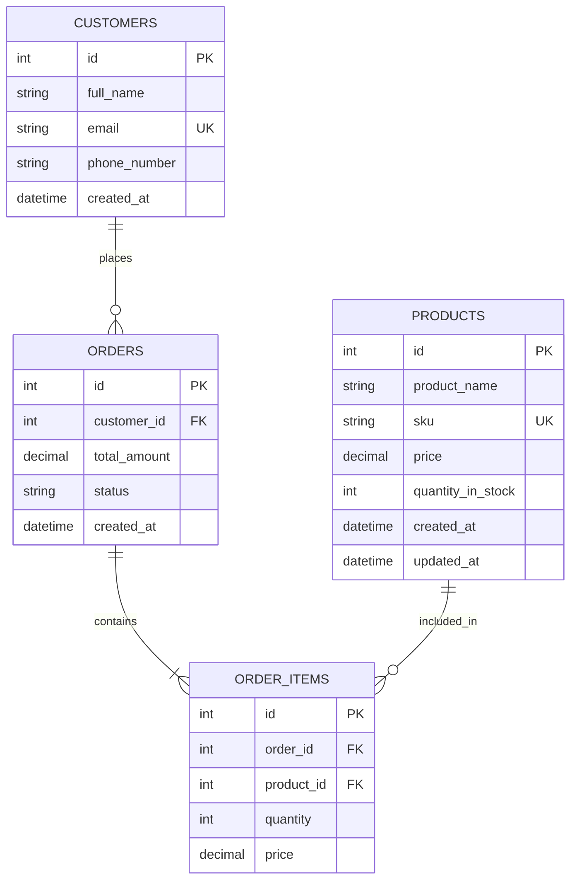

# Inventory & Order Management System

Production-ready inventory and order management system with a FastAPI backend, React dashboard, PostgreSQL, Docker Compose, Alembic, tests, and CI/CD.

## Architecture

```text
backend/app
  routes -> services -> repositories -> SQLAlchemy models
frontend/src
  pages -> reusable components -> Axios API service
postgres
  products, customers, orders, order_items
```

## ER Diagram



## Local Development

```bash
docker compose up --build
```

Frontend: http://localhost:3000  
Backend: http://localhost:8000  
OpenAPI docs: http://localhost:8000/docs

Backend without Docker:

```bash
cd backend
python -m venv .venv
.venv\Scripts\activate
pip install -r requirements.txt
uvicorn app.main:app --reload
```

Frontend without Docker:

```bash
cd frontend
npm install
npm run dev
```

## Sample Data

Seed around 150 sample business records: 70 products, 40 customers, 40 orders, and 12 intentionally low-stock products for dashboard testing.

Local backend:

```bash
cd backend
python -m app.utils.seed_data
```

Docker backend:

```bash
docker compose exec backend python -m app.utils.seed_data
```

Customize the amount:

```bash
python -m app.utils.seed_data --products 80 --customers 40 --orders 30
```

## API Examples

Create product:

```bash
curl -X POST http://localhost:8000/products -H "Content-Type: application/json" -d "{\"product_name\":\"Laptop\",\"sku\":\"LAP-001\",\"price\":999.99,\"quantity_in_stock\":10}"
```

Create customer:

```bash
curl -X POST http://localhost:8000/customers -H "Content-Type: application/json" -d "{\"full_name\":\"Ava Stone\",\"email\":\"ava@example.com\",\"phone_number\":\"+15550001\"}"
```

Create order:

```bash
curl -X POST http://localhost:8000/orders -H "Content-Type: application/json" -d "{\"customer_id\":1,\"products\":[{\"product_id\":1,\"quantity\":2}]}"
```

Validation and error behavior:

- Duplicate SKU or email returns `409 Conflict`.
- Negative stock, non-positive price, or empty order products return `422 Unprocessable Entity`.
- Insufficient inventory returns `400 Bad Request`.
- Missing product, customer, or order returns `404 Not Found`.

## Tests

```bash
cd backend && pytest
cd frontend && npm test
```

## Deployment

### Backend on Render

1. Create a PostgreSQL database in Render.
2. Create a Web Service from this repository.
3. Root directory: `backend`.
4. Build command: `pip install -r requirements.txt`.
5. Start command: `uvicorn app.main:app --host 0.0.0.0 --port $PORT`.
6. Set `DATABASE_URL`, `SECRET_KEY`, `FRONTEND_URL`, and `ENVIRONMENT=production`.

### Backend on Railway

1. Add a PostgreSQL plugin.
2. Deploy the `backend` directory.
3. Set `DATABASE_URL`, `SECRET_KEY`, `FRONTEND_URL`, and `ENVIRONMENT=production`.
4. Start command: `uvicorn app.main:app --host 0.0.0.0 --port $PORT`.

### Backend on Fly.io

```bash
cd backend
fly launch
fly postgres create
fly postgres attach <db-name>
fly secrets set SECRET_KEY=<secret> FRONTEND_URL=<frontend-url> ENVIRONMENT=production
fly deploy
```

### Frontend on Vercel

1. Import the repository.
2. Root directory: `frontend`.
3. Build command: `npm run build`.
4. Output directory: `dist`.
5. Set `VITE_API_URL` to the deployed backend URL.

### Frontend on Netlify

1. New site from Git.
2. Base directory: `frontend`.
3. Build command: `npm run build`.
4. Publish directory: `frontend/dist`.
5. Set `VITE_API_URL` to the deployed backend URL.

## Docker Hub Publishing

```bash
docker build -t <dockerhub-user>/inventory-backend:latest ./backend
docker build -t <dockerhub-user>/inventory-frontend:latest ./frontend
docker push <dockerhub-user>/inventory-backend:latest
docker push <dockerhub-user>/inventory-frontend:latest
```

## Production Best Practices

- Use managed PostgreSQL with automated backups and private networking.
- Run Alembic migrations during release, not from request-serving code.
- Keep `SECRET_KEY` and database credentials in the platform secret manager.
- Restrict CORS to the deployed frontend URL.
- Add request logging, metrics, tracing, and alerting before public launch.
- Put the backend behind HTTPS and platform-level rate limiting.
- Use non-root Docker users and scan images before publishing.
